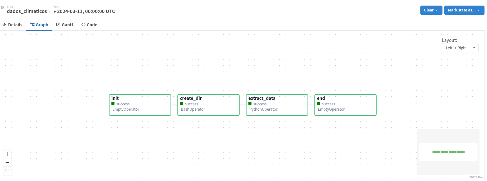

Overview
========

##### Projeto de ETL/ELT

##### Empresa de Turismo precisa obter a previsão de tempo para os próximos 7 dias para conseguir adequadar os melhores passeios e serviços ofertados para seus clientes de acordo com a previsão do tempo.

*   Iremos Utilizar o modelo Medalhão ( Bronze / Silver / Gold)
*   Armazenamento de Previsão do tempo, condições climaticas e temperaturas
*   Orquestração com Apache airflow para execução do pipeline toda segunda feira


1) Para isso faremos a Extração dos dados através de API ( visualcrossing )
2) Iremos armazenar esses dados brutos na camada Bronze
3) Iremos armazenar os dados tratados na camada Silver
4) Iremos armazenar os dados prontos para consumo na camada Gold


### Instalação e Configuração
========
1. Clone o repositório:

```bash
git clone https://github.com/claytoncampos/data_pipeline_airflow
cd data_pipeline_airflow
```

2. Configure a versão correta do Python com `pyenv`:

```bash
pyenv install 3.9.18
pyenv local 3.9.18

ou instale o poetry 
pip install poetry
```

3. Instale as dependências do projeto:

```bash
# Instale o Docker e docker-compose
# Intale o pyenv
pip install pyenv
# crie seu ambiente virtual
python -m venv .venv
# O padrao é utilizar .venv
source .venv/bin/activate
# Usuários Linux e mac
.venv\Scripts\Activate
# Usuários Windows
pip install -r requirements.txt 
# poetry
poetry install
 ```
4. Crie o arquivo .env com a KEY da API gerada no site visualcrossing, substitua o <CHAVE> pela KEY

```bash
KEY=<CHAVE>
```
5. Inicie o Airflow local em modo standalone:

```bash
airflow standalone
```

6. Acesso localhost:8080
Pegue a senha no log ou no arquivo gerado standalone_admin_password

7. Opcionalmente pode usar o docker para subir o airflow em container.</br>

7.1 Pré Req</br>
Instale o docker e docker compose

    Use o docker-compose.yml que está dentro do diretorio /compose

